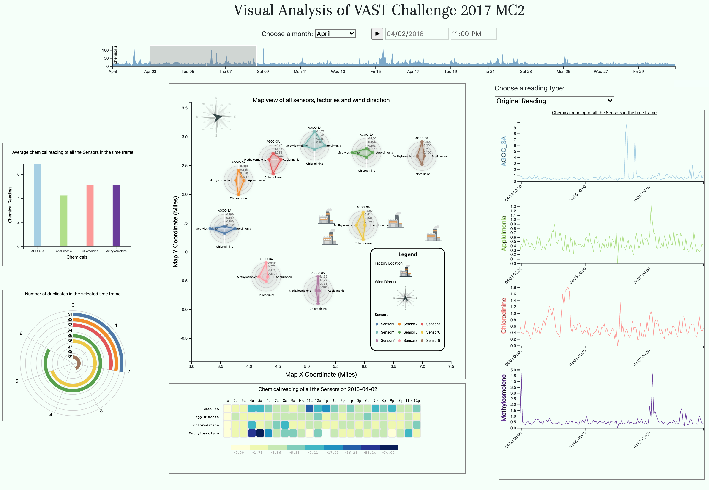

# IEEE-VAST-Challenge-2017-MC2
Visual Analysis of VAST 2017 Mini Challenge 2

Live firebase deployement of the project: https://ieee-vast-challenge-mc2.web.app/

# Visual Analysis of VAST 2017 Mini Challenge 2

## Team Members
- [Jayasurya Sevalur Mahendran](https://www.github.com/imjaya)
- [Raghavendhar T V](https://www.github.com/raghav1397)
- [Ashish Santha Kumar](https://www.github.com/AshishSanthaKumar)
- [Sriprashanth Ramamoorthy](https://www.github.com/rspixers)
- [Venkatramanan Srinivasan](https://www.github.com/Venkat19967)
- [Omar Alnoman](https://www.github.com/oalnoman)


## The Visual Dashboard 



## Installing
Dependencies:
  * Python 3

## Module description

* index.html - Basic structure of the webpage is defined here in which all the charts are rendered.
* scripts folder - This contains all the JavaScript files. The radar chart uses mainChartConfig.js, mainChartScript.js, radarChart.js and util.js. All the other chart uses script.js 
* MC2Data folder - This contains all the processed data files for heatmap, column chart, radial chart and timeline chart.
* mainchart folder - This hold the data and the image files for the Innovative Map view.
* linechart folder - This folder contains python notebook files and the data for the line chart
* IMG folder - This contains the screen shot of the final dashboard
* css folder - This contains the stylesheets for all the charts.

## Running the Project

To start the live server on port 8000:
```sh
python -m SimpleHTTPServer 8000
```

URL:
```sh
http://localhost:8000/
```


